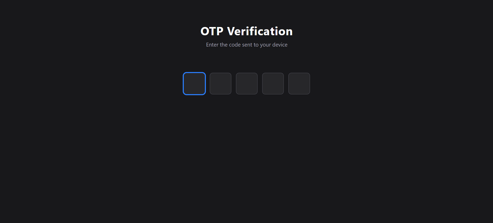

# 🔐 OTP Input

A sleek, auto-focusing OTP (One-Time Password) input component built with React — clean UI, smooth keyboard navigation, and zero external dependencies.

## ✨ Features

- 🔢 Auto-focus moves to the next box as you type
- ⌫ Backspace navigates back to the previous box
- 🚫 Numeric-only input validation
- 🎯 Auto-focus on the first input when the page loads
- 🎨 Modern dark-themed UI with smooth focus transitions

## 🛠️ Tech Stack

## 📸 Screenshot

## 💡 How It Works

Each input box is tracked via a `ref` array. On typing a digit, focus automatically shifts to the next box; on backspace with an empty box, focus shifts back — giving that classic, seamless OTP-entry feel.

---

⭐ If you like this project, consider giving it a star!